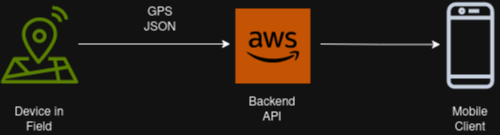
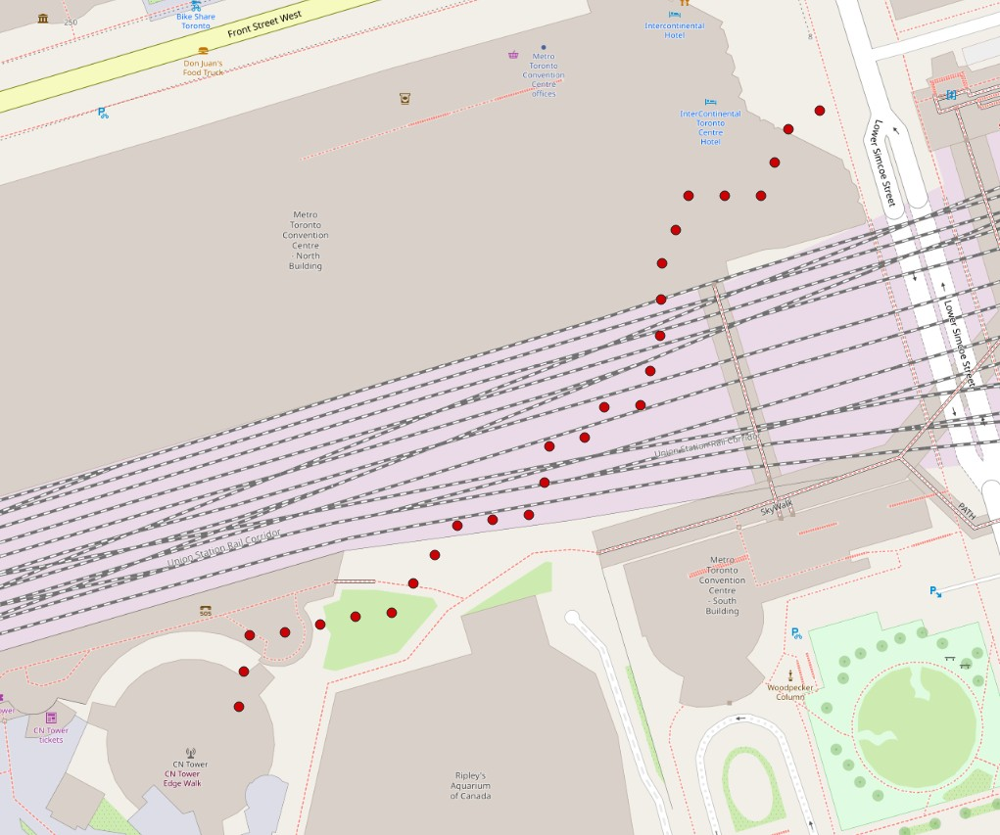

# Backend Cloud Project

This project is a simple implementation of providing an API endpoint for device location data.

## Context



A device in the field emits GPS location data at 1Hz. The coordinates change as the device is in motion.

Mobile clients connect via an API endpoint(s) to accomplish two things:

1.  Get the latest device location
2.  Get the device location history/GPS trace where the device has been since powered on

The user wishes to view, via a mobile or web app, the current location and traversed path, think history, of where the device has been.

## Task

Design and implement a method and/or API endpoint(s) that will allow a HTTP client to pull the current and traversed path since device has been powered on.

### Requirements

-   The latest device location can be no more than a few second old
-   Client needs a response in JSON format
-   Implement using [Django Rest Framework](https://www.django-rest-framework.org/)
-   If using third party software such as Postgres, provide instructions on how to run such services locally or via docker
-   If infrastructure resources needed, prefer to use AWS managed resources

## Assumptions

-   All GPS data from the device is considered high quality, and constant 1Hz rate, no malicious intent or spoofing etc
-   Client device can have processing power of a iPad Pro to a 4 year old Android phone
-   Client device will have stable internet, but wide range of bandwidth, think 5G to 3G
-   Client device has no restrictions on how to query or temporarily store data
-   Client device may request current location and traversed path at any time. This maybe:
    -   Before device is online
    -   While device is online and currently moving
    -   Shortly after device is offline, a few minutes max
-   Device traversed path does not have to be exact replay of location point for point, but at least be a general representation, some error is allowed
-   API maybe hosted in a fleet behind a load balancer, no guarantee that all API calls be routed through same server/container

### Things to know

-   Authentication and authorization is outside scope
-   The method of displaying/rendering of the information is outside scope
-   Long term persistence of this traversed data is outside scope, Client will not request historical traces
-   Will be testing the endpoint(s) with curl/httpie to inspect responses
-   Feel free to use other services via docker such as a database or key val store
-   If the deliverables don't work on tester's computer we'll be screen sharing/evaluating the deliverables on your computer
-   **STOP AT MAX 3 HOURS**, what isn't done we can discuss and go from there. No penalty for stopping at 3 hr as this project scope may be too big for 3 hours.

### Deliverables

-   Working Django implementation to serve as Proof of Concept
-   Simple architecture diagram of how service would be deployed in AWS to handle a few dozen devices or more
-   Brief docs on how to run deliverables for evaluation

### Nice To Have

**Only if** you complete early and have time within the 3 hour time limit

-   Tests
-   Documentation
-   Anything else you can think of :)

## Boilerplate Code

Provided is a bare bones Django setup and in field Device Simulator. These have been provided to help jump start the project. Feel free to modify, change, or discard anything as needed.

### Django

A single endpoint, `/device/PRIMARYKEY` endpoint stub has been defined to help you get started. The provided code supports `GET` and `PUT`. Feel free to change this and the Device Simulator code if you can further improve things.

To start the the backend

```bash
# in the provided project root folder
$ python3 -m venv .venv
$ source .venv/bin/activate

# install deps
$ pip install -r build/requirements.txt

# migrate models, using sqlite
$ python manage.py migrate

# start django
$ python manage.py runserver
```

### Device Simulator

A device simulator script to simulate a device in motion. The script generates a new location once a second and sends it to the backend, `PUT /device/123/` with a JSON payload defined as _Device Location_ in the References section. If you are happy with the setup, data, and information passed to the endpoint no modification is needed.

The simulator script starts in Toronto ON and moves 10 meters at a time heading North East. It walks in a random pattern that may include straight lines and pauses in same location.

```bash
$ python3 scripts/device_sim.py
```

The walked path will change between simulator runs, but in general should be North East.



## References

### Device Location

A sample device payload generated by `scripts/device_sim.py` is below and sent to the Django API.

```json
{
  "lon": 34.51121,
  "lat": 45.23453
  "alt": 0
}
```