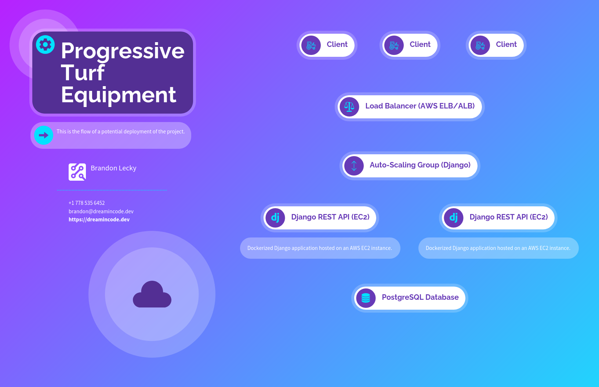

# Django Device Location API



## Overview

This project provides a Django-based API endpoint for managing device location data. The devices emit GPS location data at a rate of 1Hz, and this API allows clients to interact with the data in various ways.

## Getting Started

#### There is a Makefile with commands, or you can run them manually. 

```bash
# Build
make build

# Start
make start

# Migrate
make migrate

# Create superuser (optional)
make createsuperuser

# Run tests
make test

# Run server
make shell
# then
./manage.py runserver 0.0.0.0:8000

# Run device simulator
make device_sim

# Clean up
make cleanup
```

## Models

The `Device` model represents a device in the field, and it has the following fields:

- `locations`: A JSON field to store the GPS location data.
- `last_update`: A DateTime field indicating the last time the device location was updated.

### Methods

- `last_location`: A property that returns the last recorded location of the device.
- `add_location(lon: float, lat: float, alt: float)`: A method to add a new location to the device, updating the `last_update` field. It also keeps the number of recorded locations within a limit (5 in this case).

## API Views

### DeviceView ViewSet

This ViewSet provides various views for managing device location data.

#### List View

- URL: `/devices/`
- Method: `GET`
- Response: Returns a list of all devices and their basic information.

#### Retrieve View

- URL: `/devices/{pk}/`
- Method: `GET`
- Response: Returns detailed information about a specific device identified by its primary key.

#### Update View

- URL: `/devices/{pk}/`
- Method: `PUT`
- Request Payload: JSON data containing the new location (lon, lat, alt).
- Response: Indicates whether the update was successful.

#### Destroy View

- URL: `/devices/{pk}/`
- Method: `DELETE`
- Response: Deletes the specified device and returns a success message.

#### Last Location View

- URL: `/devices/{pk}/last_location/`
- Method: `GET`
- Response: Returns the last recorded location of the specified device.
